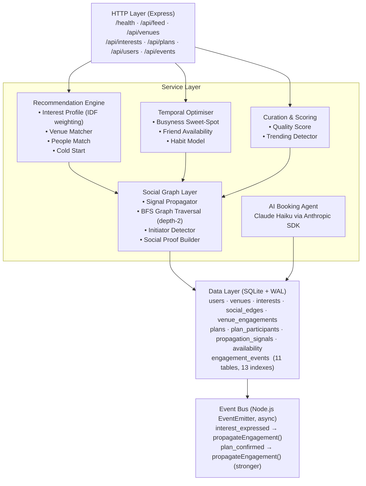
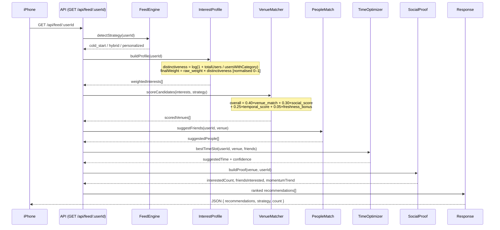
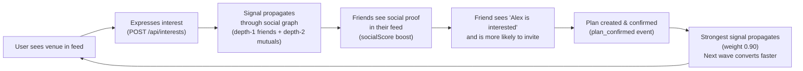
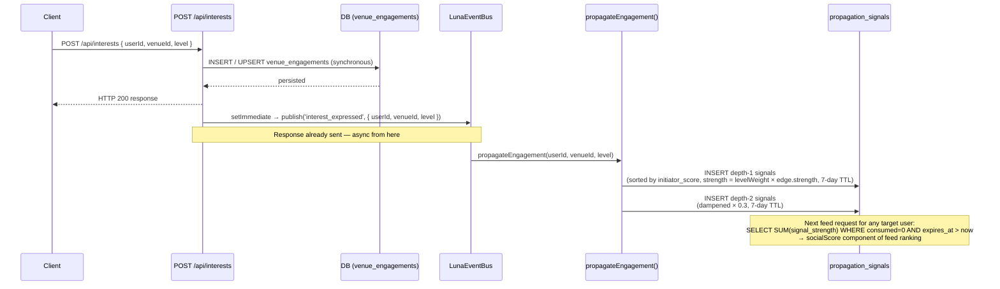

# Luna Social — Track 2: Recommendation Engine & Social Graph Backend

> **Track 2 Backend submission** for the Luna Social take-home assignment.
> AI-powered venue recommendations, social graph propagation, temporal optimisation, and an autonomous AI booking agent — built on Node.js + TypeScript + SQLite.

---

## Table of Contents

1. [What Was Built](#what-was-built)
2. [Architecture Overview](#architecture-overview)
3. [Setup & Prerequisites](#setup--prerequisites)
4. [Running the Project](#running-the-project)
5. [API Reference](#api-reference)
6. [Core Algorithms & Design Decisions](#core-algorithms--design-decisions)
7. [Database Schema](#database-schema)
8. [Event-Driven Pipeline](#event-driven-pipeline)
9. [Testing](#testing)
10. [iOS Test Client](#ios-test-client)
11. [AI Agent Usage](#ai-agent-usage)
12. [Third-Party Resources](#third-party-resources)
13. [Trade-offs & What Would Change at Scale](#trade-offs--what-would-change-at-scale)

---

## What Was Built

Luna's backend solves all three connected problems from the Track 2 spec:

| Spec Requirement | Status | What Was Built |
|---|---|---|
| Venue sourcing & curation | ✅ | Quality scoring, trending velocity detection, editorial picks |
| Personalised recommendations | ✅ | IDF-weighted interest profiles, venue-user matching |
| Cold start handling | ✅ | 3-tier strategy: `cold_start` / `hybrid` / `personalized` |
| People matching | ✅ | 4-factor friend/mutual scoring per recommendation |
| Temporal optimisation | ✅ | Gaussian busyness sweet-spot + friend availability model |
| Social graph propagation | ✅ | Depth-2 BFS with TTL decay + initiator detection |
| Event-driven async pipeline | ✅ | EventEmitter pub/sub — propagation never blocks HTTP |
| AI Booking Agent (bonus) | ✅ | Claude Haiku via Anthropic SDK with mock fallback |
| Test coverage | ✅ | 54 tests, 8 suites, all passing |

---

## Architecture Overview



### Feed Request Data Flow



### The Social Proof Flywheel



---

## Setup & Prerequisites

### Requirements

| Dependency | Version | Notes |
|---|---|---|
| **Node.js** | ≥ 20.0 | LTS recommended |
| **npm** | ≥ 10.0 | Bundled with Node |

> No external database, Docker, Redis, or cloud services required. Everything runs locally with zero infrastructure.

### Install

```bash
git clone <repo-url>
cd recommendation-engine-social-backend

npm install
```

### Environment Variables

Create a `.env` file in the project root (all optional):

```env
# Server port (default: 3000)
PORT=3000

# SQLite database file path (default: ./luna.db, auto-created on first run)
DATABASE_PATH=./luna.db

# Anthropic API key — required only for live AI booking agent
# Without this, booking uses a realistic mock response (everything else still works)
ANTHROPIC_API_KEY=sk-ant-...
```

---

## Running the Project

### Development

```bash
npm run dev
```

Starts at `http://localhost:3000` via `ts-node`. The SQLite database (`luna.db`) is created automatically on first start and seeded with 10 users and 20 NYC venues.

### Production Build

```bash
npm run build    # Compiles TypeScript + copies schema.sql to dist/
npm start        # node dist/server.js
```

### Re-seed

```bash
rm -f luna.db    # Delete existing database
npm run dev      # Fresh seed on startup
```

### Verify

```bash
curl http://localhost:3000/health
# → {"status":"ok","service":"luna-recommendation-backend","ts":"..."}

curl "http://localhost:3000/api/feed/u1?limit=3"
# → {"recommendations":[...],"strategy":"personalized","count":3}
```

---

## API Reference

### `GET /health`

```json
{ "status": "ok", "service": "luna-recommendation-backend", "ts": "2026-03-25T19:00:00Z" }
```

---

### `GET /api/feed/:userId?limit=10`

Personalised venue recommendations. Strategy auto-selected based on engagement depth.

```bash
curl "http://localhost:3000/api/feed/u1?limit=5"
```

```json
{
  "recommendations": [
    {
      "venue": {
        "id": "v5", "name": "Bemelmans Bar", "category": "jazz clubs",
        "rating": 4.7, "priceLevel": 4,
        "vibeDescription": "Old New York elegance with live jazz nightly",
        "trendingScore": 0.62, "qualityScore": 0.89
      },
      "suggestedPeople": [
        { "userId": "u2", "name": "Sarah Kim", "reason": "friend",
          "compatibilityScore": 0.82, "sharedInterests": ["jazz", "cocktails"] }
      ],
      "suggestedTime": {
        "startTime": "2026-04-04T19:00:00Z", "endTime": "2026-04-04T22:00:00Z",
        "confidence": 0.74, "availableFriendCount": 2,
        "reasoning": "Friday evening — high friend availability, venue at sweet-spot busyness"
      },
      "score": {
        "venueMatch": 0.91, "socialScore": 0.45,
        "temporalScore": 0.74, "freshnessBonus": 0.0, "overall": 0.68
      },
      "socialProof": {
        "interestedCount": 2, "planningCount": 1, "confirmedCount": 0,
        "friendsInterested": [{ "userId": "u3", "name": "Marcus Williams" }],
        "momentumTrend": "warming"
      }
    }
  ],
  "userId": "u1",
  "strategy": "personalized",
  "count": 5,
  "generatedAt": "2026-03-25T..."
}
```

---

### Venues

```bash
GET /api/venues?category=jazz+club&limit=20
GET /api/venues/:venueId?userId=u1        # includes social proof for that user
```

---

### Interests (Express Engagement)

```bash
POST /api/interests
```
```json
{ "userId": "u1", "venueId": "v5", "level": "planning" }
```

Interest levels (in ascending commitment order):
`viewed` → `interested` → `planning` → `confirmed` → `attended`

Fires `interest_expressed` event → signal propagates through social graph asynchronously.

```bash
GET /api/interests/:userId              # user's full engagement history
GET /api/interests/venue/:venueId       # all users interested in a venue
```

---

### Plans (Group Coordination)

```bash
# Create a plan and invite friends
POST /api/plans
```
```json
{
  "venueId": "v5",
  "createdBy": "u1",
  "scheduledTime": "2026-04-04T19:00:00Z",
  "inviteeIds": ["u2", "u3"]
}
```

```bash
GET  /api/plans/:planId
GET  /api/plans/user/:userId           # my created plans
GET  /api/plans/invitations/:userId    # invitations I've received

POST /api/plans/:planId/respond
```
```json
{ "userId": "u2", "response": "accepted" }    # "accepted" | "declined" | "maybe"
```

```bash
POST /api/plans/:planId/book           # triggers AI booking agent
```

---

### Users

```bash
GET /api/users/:userId
GET /api/users/:userId/friends
```

---

### Events (Behavioural Tracking)

```bash
POST /api/events
```
```json
{ "type": "venue_view", "userId": "u1", "venueId": "v5" }
```

Available types: `feed_view`, `venue_view`, `interest_expressed`, `interest_withdrawn`, `plan_created`, `invite_sent`, `invite_accepted`, `invite_declined`, `plan_confirmed`, `booking_initiated`, `booking_completed`

---

## Core Algorithms & Design Decisions

### 1. IDF-Weighted Interest Profiles

**Problem:** Not all interests are equally informative. Everyone likes "restaurants" — that tells you very little. A user who likes "jazz clubs" or "omakase" is a far stronger, more predictable signal.

**Solution:** Inverse Document Frequency (IDF) adapted from information retrieval, applied to social interest categories:

```
distinctiveness(category) =  log(1 + total_users / users_with_category)
                             ──────────────────────────────────────────  (normalised)
                                   max(all distinctiveness values)
```

With 10 users as an example:

| Category | Users with it | Raw IDF | Normalised |
|---|---|---|---|
| `restaurant` | 9 | log(2.11) = 0.75 | 0.31 |
| `jazz club` | 3 | log(4.33) = 1.47 | 0.61 |
| `omakase` | 1 | log(11.0) = 2.40 | **1.00** |

A user's `finalWeight` for each interest = `raw_weight × distinctiveness`, then normalised.

**Effect:** Rare interests dominate the recommendation signal. Common ones barely move the needle. This directly addresses the spec hint: *"Not all interests are equal. Someone who's into jazz clubs is a much stronger signal."*

---

### 2. Feed Scoring Formula

```
overall = 0.40 × venue_match      (interest profile × venue tags/category)
        + 0.30 × social_score     (propagation signals from friends/mutuals)
        + 0.25 × temporal_score   (confidence of best time slot suggestion)
        + 0.05 × freshness_bonus  (venue joined platform < 30 days ago)
```

**Weight rationale:**
- **0.40 venue_match** — the feed's baseline quality. Surfacing irrelevant venues destroys trust immediately.
- **0.30 social_score** — Luna's core thesis is social momentum. A venue where friends are going must rank higher.
- **0.25 temporal_score** — a "where" without a "when" is just a list. Temporal confidence makes the recommendation actionable.
- **0.05 freshness_bonus** — a small tie-breaker that gives new venues initial exposure without overwhelming quality signals.

---

### 3. Cold-Start Strategy

```
Strategy      │ Trigger              │ Venue Selection
──────────────┼──────────────────────┼──────────────────────────────────────
cold_start    │ 0 engagement events  │ Editorial picks (quality > 0.85) + Trending
hybrid        │ 1–4 events           │ 70% trending score + 30% personalized match
personalized  │ 5+ events            │ Full IDF interest profile
```

**Design thinking on cold start:** For a brand new user, the system serves editorially curated high-quality venues alongside trending ones — venues with real social momentum that any user would plausibly find compelling. Suggested friends are included from day one using graph topology alone (friend proximity, shared connections), not requiring those friends to have expressed prior interest. The philosophy: the venue's content quality and the user's social graph structure should carry the experience before personalisation data exists. Showing people who haven't expressed interest is a calculated nudge, not a fabrication — it's a prediction grounded in social proximity.

---

### 4. Busyness Sweet-Spot Model

The spec notes: *"venue busyness (sweet spot exists) — Google Popular Times is publicly available."*

A Gaussian curve peaking at 60% occupancy:

```
sweetSpotScore(b) = exp( −0.5 × ((b − 60) / 20)² )

  b = 100  →  score = 0.14   (too packed, unpleasant)
  b =  80  →  score = 0.61   (busy but manageable)
  b =  60  →  score = 1.00   ← sweet spot
  b =  40  →  score = 0.61   (quiet, low energy)
  b =  20  →  score = 0.14   (dead, no atmosphere)
```

Each venue stores a `busynessPattern[7][24]` array (day-of-week × hour, values 0–100) based on typical category-level Popular Times data. Jazz clubs peak at 22:00 on weekends; brunch spots peak at 11:00 on Sundays.

---

### 5. Time Slot Optimisation

The "when" suggestion weighs three signals:

```
slot_score = 0.50 × friend_availability   (fraction of suggested friends free at this time)
           + 0.30 × busyness_score        (sweet-spot score for venue at this hour)
           + 0.20 × habit_score           (user's historical event frequency at this day/hour)
```

**Candidate generation:** Weekends (Fri/Sat 18:00–23:00) and mid-week (Wed/Thu 18:00–23:00) for the next two weeks. This reflects Luna's use case: nights out, not Tuesday lunches.

---

### 6. Social Graph Signal Propagation

When a user engages with a venue, a timed signal propagates through their graph:

```
Engagement level weights:
  viewed:    0.10   (weak — just looked)
  interested: 0.40   (meaningful — wants to go)
  planning:  0.60   (strong — actively coordinating)
  confirmed: 0.90   (very strong — committed)
  attended:  1.00   (maximum — actually went)

depth-1 signal strength =  levelWeight × edge.strength       (7-day TTL)
depth-2 signal strength =  levelWeight × 0.30                (dampened, 7-day TTL)
```

**Initiator ordering:** Before inserting depth-1 signals, direct friends are sorted by `initiator_score` (ratio of plan_created events to total events). Plan-starters receive the signal first, making it more likely that the person who would actually organise the night out sees the venue earliest. This directly implements the spec hint: *"In any friend group, there's usually one person who initiates plans. Show them content first."*

**Why depth-2 only?** Depth-3+ produces noise — the connection is too weak to be meaningful social proof. The 0.3× dampening on depth-2 reflects that mutual friends are weaker proof than direct friends.

---

### 7. People Matching

For each venue recommendation, up to 3 friends or mutuals are suggested:

```
person_score = 0.35 × shared_interest_score    (Jaccard similarity of interest categories)
             + 0.30 × social_proximity          (edge.strength from social_edges)
             + 0.20 × venue_compatibility       (scoreVenueForUser(venue, friend_profile))
             + 0.15 × availability_score        (friend available at suggested time slot)
```

Candidates: direct friends first (labeled `reason: "friend"`), then depth-2 mutuals (`reason: "mutual"`).

---

### 8. Venue Quality Scoring

```
quality_score = 0.35 × normalised_rating       ((rating − 1) / 4)
              + 0.25 × content_richness         (has_vibe_desc × 0.3 + photos/5 × 0.4 + tags/8 × 0.3)
              + 0.25 × engagement_factor        (log(1 + count) / log(1 + 500))
              + 0.15 × price_signal             (priceLevel / 4)
```

Higher price venues score slightly higher — Luna's use case is premium nights out. Content richness is weighted because a venue without a vibe description or photos is not worth surfacing regardless of its rating.

---

### 9. Why Event-Driven?

The spec states: *"Think event-driven. Engagement events should kick off async pipelines, not synchronous request handlers."*

`POST /api/interests` writes to the database synchronously (user needs the acknowledgement), then publishes via `setImmediate` — the HTTP response is already sent before propagation begins. At <10ms latency for the user, the social graph update happens invisibly in the background.

**At scale:** `setImmediate` is trivially replaced with Redis Streams or SQS — the service interface doesn't change, only the transport.

---

## Database Schema

```
┌──────────────┐      ┌─────────────────────┐      ┌───────────────┐
│    users     │      │  venue_engagements  │      │    venues     │
│──────────────│      │─────────────────────│      │───────────────│
│ id (PK)      │◄─────│ user_id  (FK)       │─────►│ id (PK)       │
│ name         │      │ venue_id (FK)       │      │ name          │
│ email        │      │ level               │      │ category      │
│ lat, lng     │      │   viewed            │      │ tags (JSON)   │
│ city         │      │   interested        │      │ rating        │
└──────────────┘      │   planning          │      │ price_level   │
       ▲              │   confirmed         │      │ busyness_pat  │
       │              │   attended          │      │  (JSON 7×24)  │
┌──────────────┐      │ created_at          │      │ quality_score │
│social_edges  │      │ updated_at          │      │trending_score │
│──────────────│      └─────────────────────┘      └───────────────┘
│ user_id (FK) │
│ friend_id(FK)│      ┌─────────────────────┐      ┌───────────────┐
│ strength     │      │ propagation_signals │      │  interests    │
│initiator_sc  │      │─────────────────────│      │───────────────│
│mutual_friends│      │ source_user (FK)    │      │ user_id (FK)  │
└──────────────┘      │ target_user (FK)    │      │ category      │
                      │ venue_id    (FK)    │      │ weight [0–1]  │
┌──────────────┐      │ signal_strength     │      │ source        │
│    plans     │      │ level               │      │   explicit    │
│──────────────│      │ expires_at (7d TTL) │      │   inferred    │
│ id (PK)      │      │ consumed (0/1)      │      │   behavioral  │
│ venue_id (FK)│      └─────────────────────┘      └───────────────┘
│ created_by   │
│ scheduled_t  │      ┌─────────────────────┐      ┌───────────────┐
│ status       │      │  engagement_events  │      │ availability_ │
│ booking_ref  │      │─────────────────────│      │    slots      │
│ booking_det  │      │ user_id  (FK)       │      │───────────────│
│  (JSON)      │      │ venue_id (FK)       │      │ user_id (FK)  │
└──────┬───────┘      │ plan_id  (FK)       │      │ day_of_week   │
       │              │ event_type          │      │ hour (0–23)   │
       ▼              │ metadata (JSON)     │      │ available     │
┌──────────────┐      │ timestamp           │      └───────────────┘
│plan_partici- │      └─────────────────────┘
│   pants      │
│──────────────│
│ plan_id (FK) │
│ user_id (FK) │
│ status       │
│   invited    │
│   accepted   │
│   declined   │
│   maybe      │
│ invited_by   │
└──────────────┘
```

**11 tables, 13 indexes.** Key compound indexes:
- `(user_id, venue_id)` on engagements and propagation signals
- `(target_user_id, venue_id, consumed, expires_at)` for fast signal queries per feed request
- `(user_id, timestamp)` on engagement_events for strategy detection

---

## Event-Driven Pipeline



---

## Testing

```bash
npm test                   # All 54 tests
npm run test:unit          # 5 unit suites (~0.3s)
npm run test:integration   # 3 integration suites (~0.5s)
```

```
Test Suites: 8 passed, 8 total
Tests:       54 passed, 54 total
Time:        ~0.8s
```

All integration tests use an **in-memory SQLite database** (`:memory:`), seeded fresh per test — zero external dependencies, zero state leakage between runs.

### What's Tested

| Suite | What It Covers |
|---|---|
| `venueScorer.test` | Quality & trending score computation, edge cases (no photos, no engagements) |
| `interestProfile.test` | IDF distinctiveness weights, normalisation, behavior signal extraction |
| `peopleMatch.test` | Friend/mutual scoring, Jaccard shared interest, ranking order |
| `timeOptimizer.test` | Gaussian sweet-spot, candidate generation, friend availability weighting |
| `signalPropagator.test` | Signal insertion depth-1 and depth-2, TTL expiry, signal consumption |
| `feed.test` | End-to-end `cold_start` / `hybrid` / `personalized` feed generation |
| `interests.test` | Interest creation, upsert behaviour, engagement history retrieval |
| `plans.test` | Plan creation, invitations, accept/decline flow, booking trigger |

---

## iOS Test Client

A companion SwiftUI iOS app (`LunaTestUI-iOS/`) was built to test all backend endpoints from a physical iPhone. It provides an interactive UI covering every API surface.

### Tabs

| Tab | What to Test |
|---|---|
| **Feed** | Personalised recommendations with scores, strategy badge, social proof. Pull to refresh. |
| **Venues** | Browse all 20 venues, filter by category, view social proof per user |
| **Plans** | Create a plan with venue + date + invited friends, accept invitations, tap "Book with AI Agent" |
| **Interests** | Express interest at different levels, view history per user, view by venue |
| **Users** | Profiles and friend graphs for all 10 seed users |
| **Dev** | Health check, event firing, quick API tests, raw JSON response viewer, server URL config |

### Deploy to iPhone

```bash
cd LunaTestUI-iOS

xcodebuild \
  -project LunaTestUI-iOS.xcodeproj \
  -scheme LunaTestUI \
  -destination 'id=<DEVICE_UDID>' \
  -configuration Debug build

xcrun devicectl device install app \
  --device <DEVICE_UDID> \
  ~/Library/Developer/Xcode/DerivedData/LunaTestUI-iOS-*/Build/Products/Debug-iphoneos/LunaTestUI.app
```

Configure the Mac's local IP in the Dev tab if it differs from the default.

---

## AI Agent Usage

### Claude Code (Development Tool)

This entire project — backend, tests, and iOS app — was built using **Claude Code** (Anthropic's CLI coding agent), `claude-sonnet-4-6`, operating as an agentic coding assistant.

**How Claude Code was used:**

| Task | Description |
|---|---|
| Architecture design | Designed the layered service structure, event bus pattern, and all scoring formulas from the spec requirements |
| Schema design | All 11 tables including the `propagation_signals` TTL pattern, JSON columns, and index strategy |
| Algorithm implementation | IDF weighting, Gaussian busyness model, BFS signal propagation, people matching, venue scoring |
| Test generation | All 54 unit and integration tests, test helpers, in-memory DB pattern |
| Bug diagnosis & fixes | `better-sqlite3` Node 23 ABI incompatibility, Zod UUID validation rejecting non-UUID IDs, `schema.sql` missing from compiled output |
| iOS app | Full SwiftUI iOS app design, implementation, and physical device deployment |
| README | This document |

**Agentic patterns used:**
- Parallel file reads/writes across multiple service files in a single message
- Subagent spawning (Explore agent) for deep codebase analysis without polluting main context
- Iterative test-fail-fix cycles using Bash tool output
- Physical device deployment via `xcrun devicectl`

### Booking Agent (In-Product AI)

The AI booking agent (`src/services/agent/bookingAgent.ts`) uses **Claude Haiku** (`claude-haiku-4-5-20251001`) via the official `@anthropic-ai/sdk` to simulate a venue reservation:

```typescript
const response = await client.messages.create({
  model: 'claude-haiku-4-5-20251001',
  max_tokens: 512,
  system: `You are Luna's booking agent. Given plan and venue details,
           confirm a reservation. Return ONLY valid JSON:
           { confirmationNumber, reservationName, partySize,
             specialInstructions?, agentNotes }`,
  messages: [{ role: 'user', content: bookingPrompt }]
})
```

If `ANTHROPIC_API_KEY` is absent, a realistic mock confirmation is returned so the entire booking flow works without credentials.

---

## Third-Party Resources

| Package | Version | Purpose |
|---|---|---|
| `better-sqlite3` | ^12.8.0 | Synchronous SQLite driver. Chosen over async drivers because SQLite's single-writer model and test isolation via `:memory:` are simpler with sync I/O |
| `express` | ^4.18.2 | HTTP framework |
| `zod` | ^3.22.4 | Request body validation with composable, typed schemas |
| `uuid` | ^9.0.0 | UUID v4 generation for all entity primary keys |
| `@anthropic-ai/sdk` | ^0.36.0 | Claude Haiku API for AI booking agent |
| `dotenv` | ^16.4.1 | Environment variable loading |
| `ts-jest` | ^29.1.2 | TypeScript-native Jest transformer |
| `supertest` | ^6.3.4 | HTTP integration testing against live Express app |

**Algorithmic references:**
- IDF weighting adapted from TF-IDF information retrieval literature
- Gaussian busyness sweet-spot inspired by Google Popular Times occupancy distributions
- Depth-2 BFS signal propagation pattern inspired by social network information diffusion models (Watts-Strogatz)
- Event-driven async pipeline pattern inspired by CQRS / event sourcing

---

## Trade-offs & What Would Change at Scale

### Current Decisions (Prototype Scale)

| Decision | Why Now | Production Alternative |
|---|---|---|
| SQLite + WAL | Zero setup, perfect for demo, excellent for < 100k rows | PostgreSQL for multi-writer, horizontal scale |
| In-process EventEmitter | No infrastructure, async enough for demo | Redis Streams or AWS SQS for durable, distributed event processing |
| Propagation per HTTP request | Simple, debuggable | Batch propagation worker consuming a queue |
| Full venue scan per feed request | Fast for 20 venues | Vector similarity search (pgvector) + pre-filtered candidates |
| Interest profiles built per request | Simple, always fresh | Materialised views invalidated on new engagement events |
| `:memory:` SQLite in tests | Perfect isolation, zero teardown | Same pattern scales; test isolation is worth preserving |

### What Would Break at Scale

1. **Propagation fanout** — a user with 10,000 followers would insert 10,000 signal rows synchronously before the HTTP response. Fix: cap depth-1 to top-N by initiator score; offload to a queue.

2. **Feed scoring** — scoring all venues for every request is O(venues × interests). Fix: pre-compute normalised interest vectors; use approximate nearest neighbour search for candidate retrieval.

3. **Interest profile rebuild** — currently rebuilt from scratch on every feed request. Fix: materialise as a Redis/Postgres cache, invalidated via the event bus on new engagement.

4. **SQLite single-writer** — works for one process, fails under concurrent writes from multiple server instances. Fix: Postgres with a connection pool.

5. **7-day signal TTL (hard-coded)** — a confirmed plan creates strong social proof that might be worth surfacing for longer than a casual "interested" signal. Fix: per-level TTLs stored in the schema.
